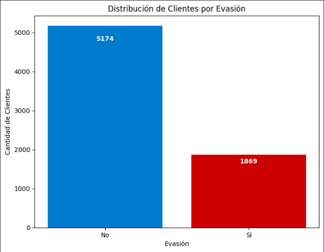
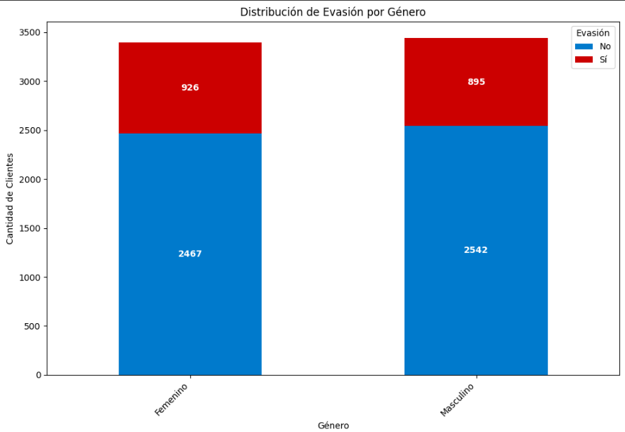
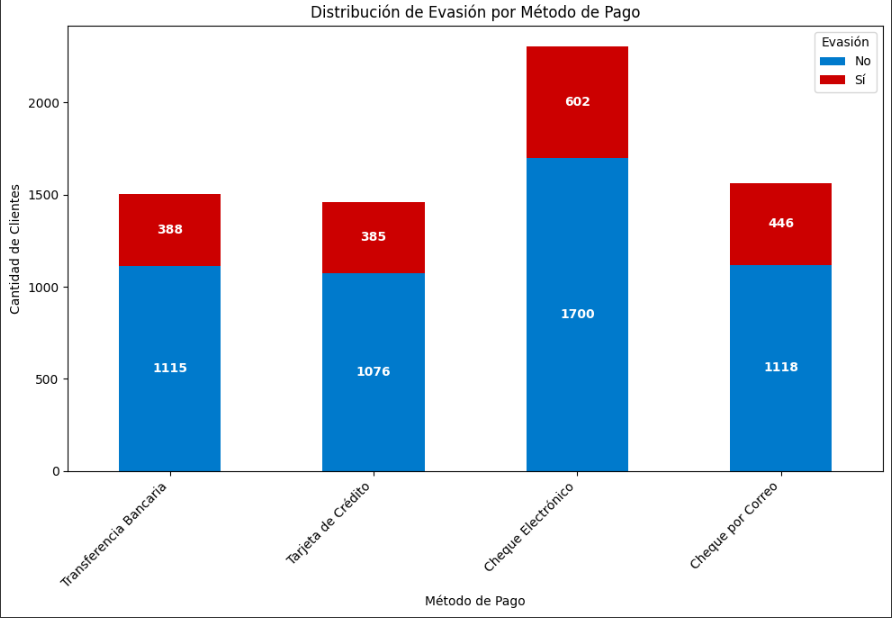
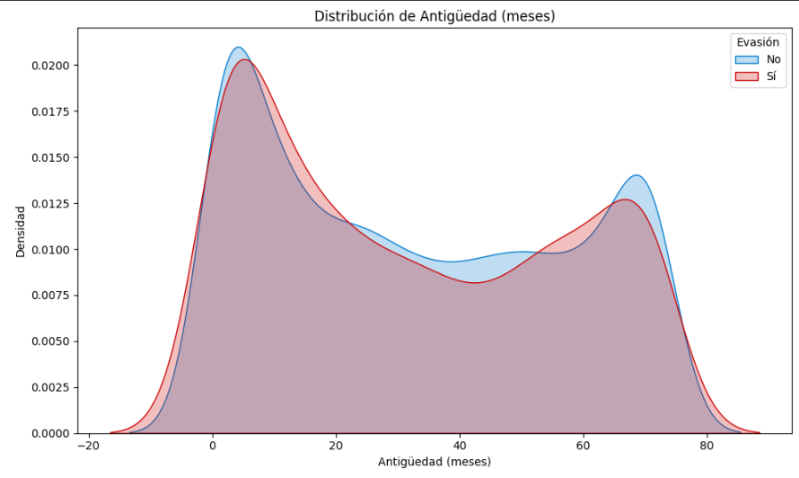
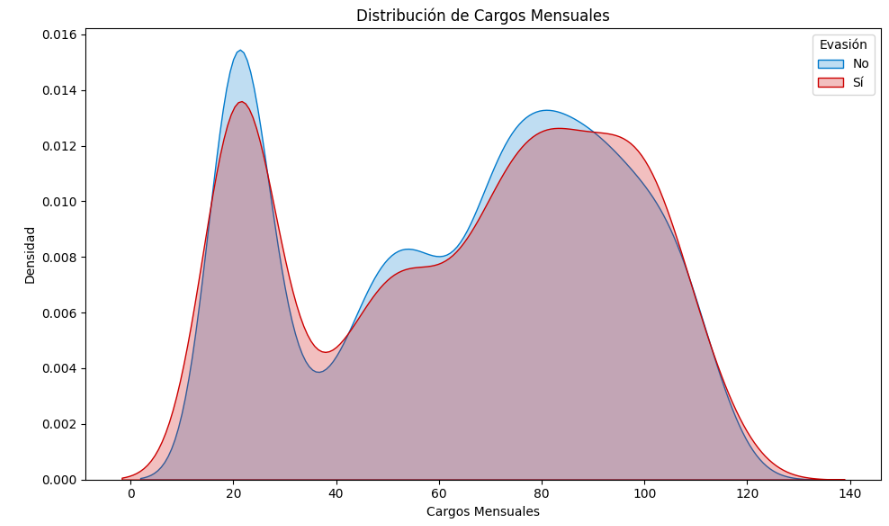
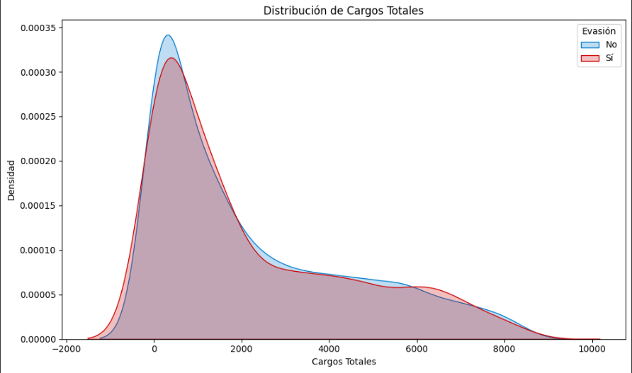
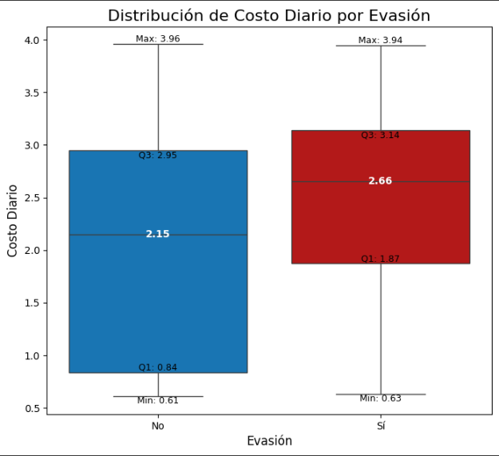
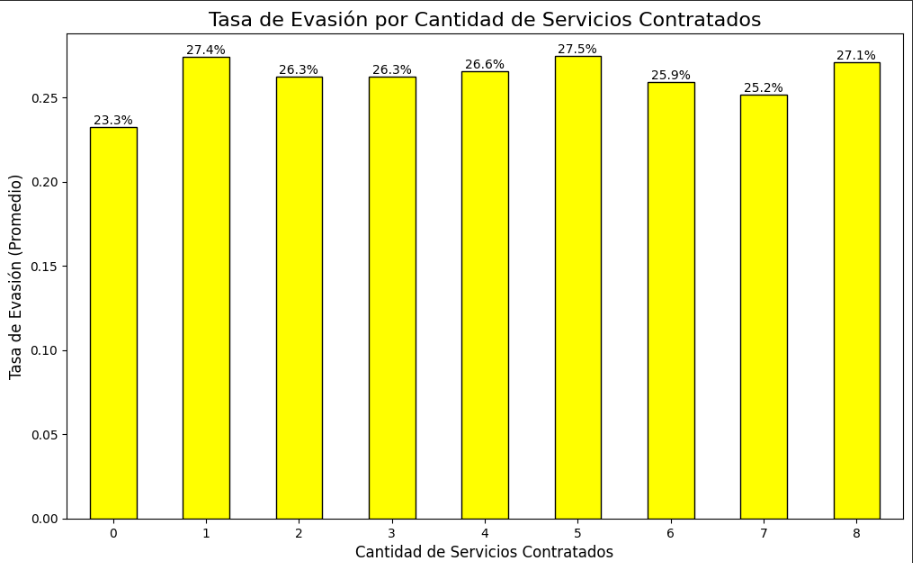
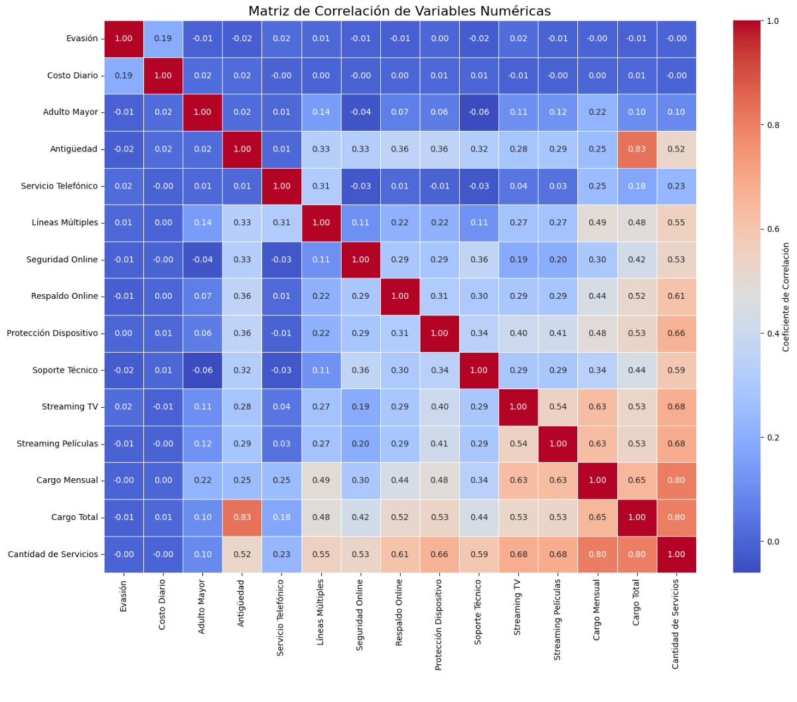

# README

📊 **Proyecto Análisis de Evasión de Clientes (Churn) de Telecom X | Challenge Alura Latam**

Un análisis exploratorio de datos (EDA) desarrollado como parte del Challenge de Data Science de Alura Latam. Permite comprender los factores que influyen en la evasión de clientes (churn) en una empresa de telecomunicaciones ficticia para proponer estrategias de retención.

---

👥 **Autor**

- **Nombre:** Felipe Guillermo Guzmán De La Fuente
- **Mail:** guzzman00@hotmail.com
- **GitHub:** Guzzman00

---

📋 **Descripción del Proyecto**

Este proyecto, contenido en un notebook de Jupyter (`TelecomX_LATAM.ipynb`), realiza un análisis detallado de datos de clientes simulados, obtenidos desde una API en formato JSON. El objetivo es extraer insights sobre:

- El perfil demográfico y de consumo de los clientes que cancelan el servicio.
- La influencia del tipo de contrato y método de pago en la tasa de evasión.
- La relación entre la antigüedad del cliente, los cargos mensuales/diarios y la probabilidad de churn.
- El impacto de la cantidad de servicios adicionales contratados en la lealtad del cliente.

Finalmente, el análisis se sintetiza en un informe final con conclusiones y recomendaciones estratégicas para reducir la evasión.

---

⚙️ **Características Técnicas del Análisis**

- **Carga de datos** desde una fuente externa (API en formato JSON).
- **Limpieza y preprocesamiento de datos** (manejo de inconsistencias, eliminación de filas con datos vacíos).
- **Transformación de datos** (creación de nuevas columnas como `Costo_Diario`, estandarización de variables categóricas a formato binario).
- **Normalización de datos anidados (JSON)** utilizando `pandas.json_normalize` para aplanar la estructura y facilitar el análisis.
- **Cálculo de métricas agregadas** (conteos, promedios, tasas de evasión por grupo).
- **Análisis de correlación** entre variables numéricas.
- **Visualización de datos** con `Matplotlib` y `Seaborn` (gráficos de barras, gráficos de densidad, boxplots y heatmaps).
- **Informe final estructurado** con conclusiones y recomendaciones basadas en datos.

---

🛠️ **Tecnologías Utilizadas**

- **Python 3**
- **Pandas** (Manipulación y análisis de datos)
- **Matplotlib** (Visualización de datos estática)
- **Seaborn** (Visualización de datos estadística y estética)
- **Jupyter Notebook / Google Colab** (Entorno de desarrollo)

---

✅ **Requisitos del Challenge Cumplidos**

Este proyecto cumple con todos los requisitos de análisis solicitados en el challenge:

1.  **Extracción de datos:** Se cargaron los datos correctamente desde la API en formato JSON.
2.  **Limpieza de datos:** Se identificaron y trataron las inconsistencias en la columna `Churn`, eliminando filas con valores vacíos.
3.  **Transformación y estandarización:** Se creó la columna `Cuentas_Diarias`, se estandarizó la columna `Churn` a formato binario y se normalizaron los datos JSON anidados para su análisis.
4.  **Análisis descriptivo:** Se realizó un análisis inicial de las variables usando el método `describe()`.
5.  **Distribución de evasión:** Se visualizó la proporción de clientes que cancelaron el servicio frente a los que no.
6.  **Análisis por variables categóricas y numéricas:** Se crearon gráficos de barras y de densidad para comparar la distribución de la evasión según género, tipo de contrato, método de pago, antigüedad y cargos.
7.  **Análisis de Correlación (Extra):** Se realizó la exploración opcional, creando nuevas variables como `Cantidad_Servicios` y visualizando la relación entre todas las variables numéricas mediante un heatmap.
8.  **Informe Final:** Se elaboró una síntesis del análisis, conclusiones y recomendaciones estratégicas.

---

🔍 **Estructura del Proyecto (Notebook)**

El notebook `TelecomX_LATAM.ipynb` está organizado en las siguientes secciones principales:

- **📌 Extracción** (Carga de datos desde la API)
- **🔧 Transformación**
    - Conocimiento del Conjunto de Datos
    - Comprobación y Manejo de Incoherencias
    - Creación de Nuevas Variables y Estandarización
- **📊 Carga y Análisis**
    - Análisis Descriptivo
    - Distribución de Evasión
    - Recuento de Evasión por Variables Categóricas
    - Conteo de Evasión por Variables Numéricas
- **📍 ¡Extra! Análisis de Correlación** (Relación costo/evasión, impacto de cantidad de servicios, matriz de correlación)
- **📄 Informe Final** (Síntesis, conclusiones y recomendaciones)

---

📦 **Guía de Instalación y Ejecución**

- **Entorno:** Este notebook está diseñado para ejecutarse en **Google Colab**.
- **Librerías:** Las librerías principales (`pandas`, `matplotlib`, `seaborn`) suelen estar preinstaladas en Colab. No se requieren instalaciones adicionales.
- **Abrir Notebook:** Sube o abre el archivo `TelecomX_LATAM.ipynb` en Google Colab.
- **Ejecutar Celdas:** Ejecuta las celdas de código en orden secuencial (de arriba abajo, usando **Shift+Enter** o el botón de Play). Es **crucial** ejecutar las celdas de las secciones **Extracción** y **Transformación** para que el DataFrame `df_final` esté definido y listo para los análisis posteriores.

---

💻 **Cómo Utilizar**

- Ejecuta todas las celdas del notebook en orden para replicar el análisis completo.
- Observa las salidas de cada celda: tablas de datos, gráficos y textos de análisis.
- Presta especial atención a las visualizaciones para identificar patrones de comportamiento de los clientes.
- Lee el informe final para entender las conclusiones y las estrategias de retención propuestas.
- Puedes modificar parámetros en el código (ej. colores de gráficos, variables a analizar) y re-ejecutar para explorar variaciones.

---

🎨 **Vista Previa**

# Informe Final: Análisis de Evasión de Clientes en Telecom X

---

## Introducción

### Objetivo del Análisis

El presente informe detalla el análisis realizado sobre los datos de clientes de Telecom X, una empresa de telecomunicaciones ficticia en América Latina. El objetivo principal es identificar los factores clave que influyen en la evasión de clientes (churn) y, a partir de estos hallazgos, proponer estrategias de retención efectivas.

### El Problema de la Evasión de Clientes (Churn)

La evasión de clientes es una métrica crítica en la industria de las telecomunicaciones, un mercado altamente competitivo donde la retención de clientes es fundamental para la rentabilidad. La pérdida de clientes no solo implica una disminución en los ingresos recurrentes, sino también un aumento en los costos asociados con la adquisición de nuevos clientes. Comprender por qué y cuándo los clientes deciden cancelar sus servicios es el primer paso para desarrollar programas de lealtad y estrategias proactivas que mejoren la satisfacción y fomenten relaciones a largo plazo.

Este análisis exploratorio de datos (EDA) sienta las bases para futuras iniciativas, como la construcción de modelos de aprendizaje automático capaces de predecir qué clientes tienen un alto riesgo de abandonar la compañía.

---

## Limpieza y Tratamiento de Datos

### 📌 Extracción

En esta fase inicial, el objetivo fue obtener los datos de los clientes de Telecom X. La fuente de datos fue una API que proporcionaba la información en formato JSON.

#### Carga de Datos desde la API

Se utilizaron las bibliotecas de Python, específicamente `pandas`, para conectarse a la API y cargar los datos directamente en un DataFrame. Este método es eficiente y permite una transición fluida del formato JSON a una estructura tabular para el análisis.

El conjunto de datos inicial constaba de **7267 filas y 6 columnas**, que contenían información sobre la identificación del cliente, el estado de evasión y datos anidados sobre el cliente, los servicios telefónicos, los servicios de internet y la cuenta.

### 🔧 Transformación

Una vez extraídos los datos, la siguiente etapa crucial fue la transformación, que implicó comprender la estructura de los datos, limpiar las inconsistencias y prepararlos para el análisis.

#### Conocimiento del Conjunto de Datos

Se exploraron las columnas para entender su contenido y tipo de datos. Las columnas `customer`, `phone`, `internet`, y `account` se identificaron como objetos que contenían datos anidados en formato de diccionario.

#### Comprobación y Manejo de Incoherencias

Se llevó a cabo una revisión exhaustiva para garantizar la calidad de los datos:

* **Valores Ausentes:** No se encontraron valores nulos en el conjunto de datos.
* **Valores Duplicados:** No se detectaron filas duplicadas basadas en el `customerID` y `Churn`.
* **Errores de Formato:** La verificación inicial de tipos de datos no reveló errores obvios de formato, aunque los detalles dentro de los datos anidados se abordaron después de la normalización.
* **Inconsistencias en Categorías:** Se descubrió que la columna `Churn` contenía valores vacíos (''). Se identificaron **224 filas** con esta inconsistencia, que fueron eliminadas. El DataFrame resultante, `df_limpio`, quedó con **7043 filas**.

#### Creación de Nuevas Variables y Estandarización

Para enriquecer el análisis, se realizaron las siguientes transformaciones:

* **Creación de la Columna `Cuentas_Diarias`:** Se calculó el costo diario dividiendo los cargos mensuales por 30.
* **Estandarización de `Churn`:** La columna `Churn` se convirtió a un formato binario (`1` para 'Sí' y `0` para 'No').
* **Renombramiento de Columnas:** Las columnas se renombraron al español para una mejor comprensión.
* **Normalización de Datos Anidados:** Las columnas con datos anidados (`Cliente`, `Servicio_Internet`, `Cuenta`, etc.) se "descomprimieron" utilizando `pd.json_normalize`. Esto convirtió la información de los diccionarios en columnas individuales, creando un `df_final` listo para el análisis.

---

## Análisis Exploratorio de Datos

### 📊 Carga y Análisis

Con los datos limpios y transformados, se procedió a la fase de análisis exploratorio para descubrir patrones y obtener información sobre los factores que influyen en la evasión de clientes.

#### Análisis Descriptivo

Se calcularon estadísticas descriptivas para las variables numéricas, lo que proporcionó una visión general de medidas como la media, la mediana y la desviación estándar. La tasa de evasión promedio en el conjunto de datos se situó en un **26.5%**.

#### Distribución de Evasión

El análisis de la variable "Evasion" mostró un desbalance en los datos:

* **Clientes que no cancelaron (No):** 5174 (73.5%)
* **Clientes que cancelaron (Sí):** 1869 (26.5%)

Esta visualización inicial es clave para entender la magnitud del problema del churn.

#### Recuento de Evasión por Variables Categóricas

Se analizaron varias variables categóricas para identificar perfiles de clientes con mayor propensión a la evasión:

* **Género:** La tasa de evasión es prácticamente la misma para hombres y mujeres, lo que indica que el género no es un factor diferenciador.
* **Tipo de Contrato:** Se observa una tasa de evasión marcadamente más alta en los clientes con contrato **"Mes a Mes"**, en comparación con los contratos anuales o bianuales.
* **Método de Pago:** Los clientes que pagan con **"Cheque Electrónico"** tienen una tasa de evasión notablemente superior a los demás métodos de pago.

#### Conteo de Evasión por Variables Numéricas

La distribución de las variables numéricas reveló diferencias significativas entre los clientes que se quedaron y los que se fueron:

* **Antigüedad (tenure):** Los clientes que cancelaron tienden a tener una antigüedad mucho menor. La mayoría de las cancelaciones ocurren en los primeros meses de servicio.
* **Cargos Mensuales:** Los clientes que cancelaron suelen tener cargos mensuales más altos.
* **Cargos Totales:** Inversamente a los cargos mensuales, los clientes que cancelan tienden a tener cargos totales acumulados más bajos, lo cual está correlacionado con su menor antigüedad.

### 📍 ¡Extra! Análisis de Correlación

* **Relación entre la Cuenta Diaria y la Evasión:** El análisis de correlación mostró una correlación positiva débil (**0.1934**). El gráfico de cajas reveló que, si bien la diferencia en el costo diario promedio no es drástica, la mediana del costo diario es más alta para los clientes que cancelaron.

    

* **Impacto de la Cantidad de Servicios Contratados:** Se creó una nueva variable, `Cantidad_Servicios`, para agregar el número de servicios adicionales contratados. El análisis mostró que los clientes con menos servicios (1-2) tienen tasas de evasión más altas. La tasa disminuye a medida que se contratan más servicios, aunque vuelve a subir ligeramente para aquellos con 7 u 8 servicios.

    

* **Matriz de Correlación General:** El mapa de calor de correlación de las variables numéricas destacó varias relaciones:
    * La **Antigüedad** (`tenure`) tiene una fuerte correlación negativa con la **Evasión**, lo que confirma que los clientes más nuevos son los que más cancelan.
    * El **Costo Diario** y los **Cargos Mensuales** tienen una correlación positiva con la **Evasión**.
    * La **Cantidad de Servicios** y la **Antigüedad** están fuertemente correlacionadas con los cargos mensuales y totales.

    

---

## Conclusiones e Insights

El análisis exploratorio de los datos de Telecom X ha revelado patrones claros y ha permitido identificar un perfil de cliente con alta probabilidad de evasión. A continuación, se resumen los principales hallazgos:

* **El Factor Contrato es Determinante:** El tipo de contrato es uno de los predictores más fuertes de la evasión. Los clientes con contratos de "Mes a Mes" son significativamente más propensos a cancelar el servicio. La falta de un compromiso a largo plazo los hace más susceptibles a las ofertas de la competencia y menos tolerantes a posibles insatisfacciones con el servicio.

* **La Antigüedad como Indicador de Lealtad:** Existe una correlación negativa fuerte entre la antigüedad del cliente y la evasión. Los clientes nuevos, especialmente en sus primeros meses, representan el grupo de mayor riesgo. Esto sugiere que la experiencia inicial del cliente es crítica para su retención a largo plazo.

* **El Método de Pago Refleja el Compromiso:** El uso de "Cheque Electrónico" como método de pago se asocia con una tasa de churn considerablemente más alta. Esto podría indicar una menor vinculación financiera del cliente con la empresa y una mayor facilidad para suspender los pagos en comparación con métodos automáticos como la domiciliación bancaria o el pago con tarjeta de crédito.

* **Sensibilidad al Precio en Cargos Mensuales:** Los clientes con cargos mensuales más elevados tienen una mayor tendencia a cancelar. Esto es particularmente visible en aquellos que contratan múltiples servicios de internet, lo que sugiere que, si bien la venta de servicios adicionales aumenta los ingresos por cliente, también puede incrementar el riesgo de evasión si el valor percibido no justifica el costo.

* **El "Punto Dulce" de la Cantidad de Servicios:** Si bien tener muy pocos servicios se asocia con una mayor evasión, sobrecargar al cliente con una gran cantidad de servicios (7-8) también puede ser contraproducente. Existe un "punto dulce" (entre 3 y 6 servicios) donde la tasa de evasión es menor, lo que podría indicar un equilibrio entre el valor percibido y el costo.

---

## Recomendaciones

Con base en las conclusiones obtenidas, se proponen las siguientes recomendaciones estratégicas para que Telecom X pueda reducir de manera proactiva la tasa de evasión de clientes:

* **Fomentar la Adopción de Contratos a Largo Plazo:**
    * **Acción:** Diseñar campañas de marketing y ofertas especiales que incentiven a los clientes nuevos y existentes con contratos de "Mes a Mes" a migrar a planes de "Un Año" o "Dos Años".
    * **Justificación:** Los contratos a largo plazo son el factor de retención más fuerte identificado en este análisis. Aumentar la base de clientes con estos contratos reducirá significativamente el churn general.

* **Programa de Bienvenida y Seguimiento para Nuevos Clientes:**
    * **Acción:** Implementar un programa de "onboarding" robusto durante los primeros tres meses de servicio. Esto podría incluir llamadas de bienvenida, tutoriales, y ofertas exclusivas para mejorar la experiencia inicial.
    * **Justificación:** Dado que la mayor tasa de evasión se concentra en los clientes con poca antigüedad, fortalecer la relación desde el principio es crucial para fomentar la lealtad.

* **Optimización de Métodos de Pago:**
    * **Acción:** Ofrecer pequeños descuentos o beneficios (como gigas adicionales o acceso a contenido premium) a los clientes que migren del pago con "Cheque Electrónico" a métodos de pago automáticos.
    * **Justificación:** Reducir la fricción en el proceso de pago y aumentar la vinculación financiera del cliente puede disminuir la probabilidad de cancelación.

* **Estrategias de Venta Cruzada Inteligente:**
    * **Acción:** En lugar de enfocarse únicamente en vender más servicios, analizar el perfil de consumo del cliente para ofrecer paquetes de servicios que maximicen el valor percibido sin aumentar drásticamente el costo mensual.
    * **Justificación:** Evitar la sobrecarga de servicios y ofrecer paquetes que realmente se ajusten a las necesidades del cliente puede mejorar la satisfacción y reducir la sensibilidad al precio.

* **Sistema de Alertas Tempranas:**
    * **Acción:** Desarrollar un sistema que identifique a los clientes de alto riesgo basándose en los factores clave identificados (contrato mes a mes, poca antigüedad, cargos mensuales altos, pago con cheque electrónico).
    * **Justificación:** Este sistema permitiría al equipo de retención contactar proactivamente a estos clientes con ofertas personalizadas antes de que tomen la decisión de cancelar, aumentando así las posibilidades de retenerlos.

La implementación de estas recomendaciones, basadas en un análisis riguroso de los datos, permitirá a Telecom X tomar decisiones más informadas y estratégicas para combatir la evasión de clientes y fortalecer su posición en el mercado.